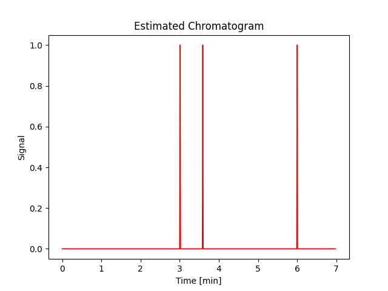

# OrgAn – Molecular Analysis and Chromatographic Simulation

**OrgAn** is a Python tool designed to analyze molecular structures from SMILES, extract key chemical properties, and simulate their separation in chromatography.
It allows for structured comparison between compounds and provides clear visual outputs of the results.

---

## Features

OrgAn allows you to:

- Extract chemical properties (logP, pKa, molecular weight, etc.) from public sources like PubChem
- Build structured molecular datasets from CSV input
- Identify gaps between chemical characteristics across compound sets
- Suggest molecules based on custom chemical criteria
- Simulate chromatographic retention behavior
- Retrieve and process molecular structures for analysis

---

## Installation

OrgAn relies on Numpy, Pandas, RDKit, Morfeus, Requests, Regex, Matplotlib

A virtual environment with Python 3.10 can be installed with Anaconda in your terminal as follows:

```
conda create -n organ python=3.10
conda activate organ
```

#### Installing from source

The first step is to clone the represitory in your local device:
```bash
git clone https://github.com/BPinsard-epfl/OrgAn.git
cd OrgAn
```
For simple user :
```bash
pip install .
```
Or for developpers :
```bash
pip install -e .
```

---

## Project Structure

```
OrgAn/
├── data/
│   └── data.csv                 
├── docs/
│   └── chromato_example.png     # Example chromatogram for the README
├── report/
│   └── report.ipynb             # Project notebook with detailed analysis
├── src/
│   └── OrgAn/
│       ├── chromato.py          # Chromatography simulation functions
│       ├── functions.py         # Main logic for filtering and gap analysis
│       └── pchem_rq.py          # Retrieves molecular data from PubChem
├── tests/                       
├── example_smiles.csv           
├── env.yml
├── pyproject.toml
├── README.md
└── LICENSE                 
```

---

## Usage

Start by loading a molecular dataset from a CSV file containing SMILES strings.

```python
from OrgAn.functions import gives_data_frame, find_pKa_gaps, find_logp_gaps, find_compounds
from OrgAn.chromato import generate_chromatogram, calculate_polarity_index

# 1. Load dataset from SMILES
# Reads a CSV file and returns a DataFrame of molecular properties
df = gives_data_frame("example_smiles.csv")

# 2. Find largest property gaps
# Returns the largest pKa and logP gaps in the dataset
pka_gaps = find_pKa_gaps(df)
logp_gaps = find_logp_gaps(df, 2)

# 3. Filter compounds by property criteria
# Retrieves the best matches for given pKa, logP, and charge values
candidates = find_compounds(pKa=4.5, logP=2.0, charge=0)

# 4. Simulate a chromatogram
# Generates a chromatogram using estimated retention times
# Define solvent composition (fractions must sum to 1.0)
pi = calculate_polarity_index(water=0.5, meoh=0.5)

generate_chromatogram(candidates, pi)
```

### Example output

This chromatogram was generated using the following molecules:

- CCO  
- CCC(=O)O  
- O=C(O)C=CC(=O)O

with a polarity index of 10.2 and a dead time of 2 minutes.



---

## Authors

- Raphaël Tisseyre  
- Bastien Pinsard  
- Johan Schmidt

---

## License

This project is licensed under the MIT License. See the `LICENSE` file for details.
